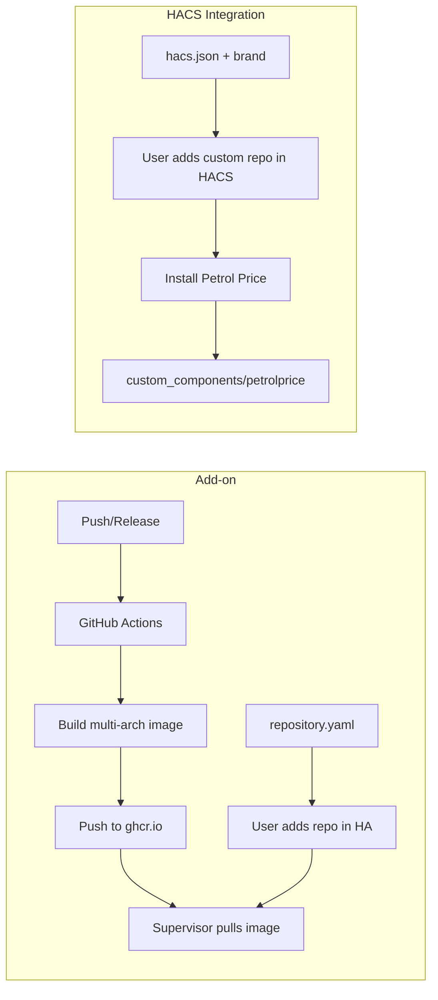

# Add-on build workflow and HACS integration

## Current structure

- **Add-on**: [petrolprice/](petrolprice/) with `config.yaml`, `Dockerfile`, `run.sh`, and `app/`. Image in config is `ghcr.io/home-assistant/{arch}-addon-petrolprice` (needs to be your GHCR path).
- **Integration**: [custom_components/petrolprice/](custom_components/petrolprice/) with manifest, config_flow, sensor, coordinator. No `hacs.json` or brand assets yet.
- No `.github/workflows` or `repository.yaml` yet.

---

## 1. Home Assistant add-on repository

### 1.1 Repository manifest

Add **repository.yaml** at the repo root so Home Assistant Supervisor can use this repo as an add-on source:

- **name**: Short name for the add-on repository (e.g. "Petrol Price Add-on").
- **url**: `https://github.com/rajeevan/PetrolPrice`
- **maintainer**: `Rajeevan` (or `Rajeevan <your@email.com>` if you want contact in HA).

Reference: [home-assistant/addons-example repository.yaml](https://github.com/home-assistant/addons-example/blob/main/repository.yaml). Add-ons are discovered from directories that contain `config.yaml` in the first two levels (your `petrolprice/` qualifies).

### 1.2 Add-on image URL

[petrolprice/config.yaml](petrolprice/config.yaml) line 21 currently has:

```yaml
image: "ghcr.io/home-assistant/{arch}-addon-petrolprice"
```

For your own repo this must point to your GitHub Container Registry. Two options:

- **Option A (recommended)**: Use a placeholder (e.g. `GITHUB_REPO_OWNER`) in `config.yaml` and replace it in the workflow with `${{ github.repository_owner }}` so the same repo works for any fork/owner.
- **Option B**: Hardcode your GitHub username in the image: `ghcr.io/rajeevan/{arch}-addon-petrolprice`.

Resulting image pattern: `ghcr.io/<owner>/{arch}-addon-petrolprice` (e.g. `amd64-addon-petrolprice`, `aarch64-addon-petrolprice`), which matches the add-on `arch` in config (`aarch64`, `amd64`).

### 1.3 GitHub Actions workflow

Add **.github/workflows/build-addon.yml** that:

1. **Triggers**: On push to `main` (optional: only on versioned tags like `v`* or on release) and on `release: published` so each release produces a stable image.
2. **Steps**:
  - Checkout repo.
  - If using Option A: replace the placeholder in `petrolprice/config.yaml` with `${{ github.repository_owner }}` (e.g. `sed` or a small script).
  - Log in to GHCR: use [docker/login-action](https://github.com/docker/login-action) with `registry: ghcr.io`, `username: ${{ github.actor }}`, `password: ${{ secrets.GITHUB_TOKEN }}`. For private repos or to avoid rate limits, a PAT with `write:packages` can be used and stored as a repo secret (e.g. `GHCR_TOKEN`).
  - Run [home-assistant/builder](https://github.com/home-assistant/builder) with:
    - `--target petrolprice` (path to the add-on directory).
    - `--docker-hub ghcr.io/${{ github.repository_owner }}` (or your fixed org name if Option B).
    - `--all` (or `--amd64` and `--aarch64`) to build both architectures.
    - Omit `--test` when pushing (e.g. on release or main); use `--test` on pull_request to validate without pushing.
3. **Permissions**: Ensure the job has `packages: write` (and `contents: read`) so `GITHUB_TOKEN` can push to ghcr.io.

Example (conceptual):

```yaml
# Build on release and optionally on main; test on PRs
on:
  release:
    types: [published]
  push:
    branches: [main]
  pull_request:
    branches: [main]

jobs:
  build:
    runs-on: ubuntu-latest
    permissions:
      contents: read
      packages: write
    steps:
      - uses: actions/checkout@v4
      - name: Set add-on image in config
        run: |
          sed -i "s|GITHUB_REPO_OWNER|${{ github.repository_owner }}|g" petrolprice/config.yaml
      - uses: docker/login-action@v3
        with:
          registry: ghcr.io
          username: ${{ github.actor }}
          password: ${{ secrets.GITHUB_TOKEN }}
      - uses: home-assistant/builder@x.x
        with:
          args: |
            --all
            --target petrolprice
            --docker-hub ghcr.io/${{ github.repository_owner }}
```

Use a fixed builder version (e.g. from [Marketplace](https://github.com/marketplace/actions/home-assistant-builder)) instead of `x.x`. For pull_request you can add `--test` to the builder args so it doesn’t push.

---

## 2. HACS (custom integration)

So users can add this repo as a **custom repository** in HACS and install the Petrol Price integration.

### 2.1 HACS manifest at repo root

Add **hacs.json** in the repo root (next to `README.md`). Required:

- **name**: Display name in HACS (e.g. `"Petrol Price"`).

Optional:

- **render_readme**: `true` to show the repo README in HACS.
- **homeassistant**: Minimum Home Assistant version (e.g. `"2024.1.0"`) if you want to enforce it.

Example:

```json
{
  "name": "Petrol Price",
  "render_readme": true
}
```

Reference: [HACS – Integrations](https://hacs.xyz/docs/publish/integration/) and [blueprint hacs.json](https://github.com/custom-components/blueprint/blob/master/hacs.json).

### 2.2 manifest.json (codeowners)

[custom_components/petrolprice/manifest.json](custom_components/petrolprice/manifest.json) already has `version`, `name`, `domain`, `documentation`, `issue_tracker`, and `config_flow`. HACS expects **codeowners** to be non-empty: use `["@rajeevan"]`. Set `documentation` and `issue_tracker` to `https://github.com/rajeevan/PetrolPrice` and `https://github.com/rajeevan/PetrolPrice/issues`.

### 2.3 Brand assets (required for HACS)

HACS requires at least one brand asset: an icon. Add:

- **custom_components/petrolprice/brand/icon.png**

Create the `brand` directory and add an `icon.png` (e.g. 48x48 or 256x256). If you don’t have one yet, you can add a placeholder and replace it later; the file must exist for HACS validation. No other brand files are strictly required.

### 2.4 Optional: info.md

You can add **info.md** at the repo root with a short description; HACS can show it. If you set `render_readme: true` in `hacs.json`, the README is often enough.

---

## 3. Flow summary




---

## 4. Files to add or change


| Action | File                                                                                                            |
| ------ | --------------------------------------------------------------------------------------------------------------- |
| Create | `.github/workflows/build-addon.yml` – build and push add-on image to ghcr.io                                    |
| Create | `repository.yaml` – add-on repository metadata for Supervisor                                                   |
| Edit   | `petrolprice/config.yaml` – set `image` to use placeholder or your ghcr.io path                                 |
| Create | `hacs.json` – HACS manifest at repo root                                                                        |
| Edit   | `custom_components/petrolprice/manifest.json` – set `codeowners`, real `documentation` and `issue_tracker` URLs |
| Create | `custom_components/petrolprice/brand/icon.png` – required brand icon (placeholder or final asset)               |


---

## 5. After implementation

- **Add-on**: In Home Assistant go to **Supervisor → Add-on store → ⋮ → Repositories**, add `https://github.com/rajeevan/PetrolPrice`. Install the Petrol Price add-on, configure it, then add the integration (via HACS or by copying `custom_components`) and point it to the add-on ingress URL.
- **HACS**: In HACS go to **Integrations → ⋮ → Custom repositories**, add `https://github.com/rajeevan/PetrolPrice`, then install “Petrol Price” from the list.
- Ensure the first add-on image build runs (e.g. by creating a release or pushing to `main`) and that `petrolprice/config.yaml`’s `image` matches the built images (same owner and naming).

No code changes are required in the add-on app or the integration beyond manifest/URLs and the new workflow and HACS/brand files.