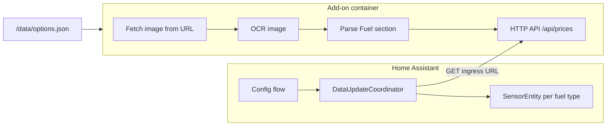

# Petrol Price Home Assistant Add-on + Custom Integration

## Goal

Two parts working together:

1. **Add-on** (Docker): Fetches images from a **configurable URL**, parses them with OCR every **configurable interval** (default 6 hours), and exposes the parsed fuel prices via an **HTTP API** (ingress).
2. **Custom integration** (runs inside Home Assistant): Creates **sensor entities directly** in Home Assistant (one per fuel type, price as state). It polls the add-on's API on a configurable interval and updates entity states—**no MQTT**.

---

## Architecture




- **Add-on**: Reads `image_url` and `scan_interval_hours` from `/data/options.json`. Loop: fetch image → OCR → parse → store result in memory; HTTP server (with **ingress**) serves `GET /api/prices` returning JSON `[{fuel_type, price}, ...]`.
- **Integration**: User configures via UI (add-on base URL or auto-detect, scan interval). Coordinator calls the add-on's ingress URL every N hours, gets JSON, updates native **SensorEntity** states. Entities are created and updated **directly in Home Assistant**.

---

## Project structure

Proposed layout: add-on plus custom integration (copy `custom_components/petrolprice` into the HA `config` folder or install via HACS):

```
PetrolPrice/
├── petrolprice/                    # Add-on root (slug: petrolprice)
│   ├── config.yaml                 # Add-on metadata + options schema + ingress
│   ├── Dockerfile
│   ├── run.sh                      # Entrypoint: run Python app
│   ├── build.yaml                  # Optional: multi-arch build
│   ├── README.md
│   └── app/
│       ├── main.py                 # Entry: load config, loop fetch→parse, run HTTP server
│       ├── ocr_parser.py           # Image fetch + OCR + "Fuel" section parsing
│       ├── api_server.py           # HTTP server exposing GET /api/prices (ingress)
│       └── requirements.txt
├── custom_components/
│   └── petrolprice/                # Custom integration (entities directly in HA)
│       ├── __init__.py
│       ├── manifest.json
│       ├── config_flow.py          # Config flow: add-on URL, scan interval
│       ├── coordinator.py          # DataUpdateCoordinator calling add-on API
│       ├── sensor.py               # SensorEntity per fuel type
│       └── const.py                # DOMAIN, defaults, etc.
├── Resources/                      # Your 2 sample images (for testing/development)
└── README.md                       # Project overview + install instructions
```

---

## 1. Add-on configuration (`config.yaml`)

Follow the [add-ons configuration](https://developers.home-assistant.io/docs/add-ons/configuration) and the [addons-example](https://github.com/home-assistant/addons-example) pattern:

- **name**, **slug** (e.g. `petrolprice`), **description**, **url**, **version**.
- **arch**: `aarch64`, `amd64` (and optionally `armhf`, `i386` if you want).
- **init**: `false` (single process).
- **ingress**: `true` so the integration (running in HA core) can call the add-on at `https://<HA>/api/hassio_ingress/<token>/` without exposing a port.
- **map**: optional (e.g. `share:rw` for logs/cache).
- **options** and **schema** (required so options are written to `/data/options.json`):


| Option                | Type   | Description                                   |
| --------------------- | ------ | --------------------------------------------- |
| `image_url`           | string | URL to fetch the fuel price image (required). |
| `scan_interval_hours` | number | Hours between scans (default 6).              |


Example schema:

```yaml
options:
  image_url: ""
  scan_interval_hours: 6
schema:
  image_url: "str"
  scan_interval_hours: "float?"
```

(Exact schema syntax may vary by HA version; align with addons-example or official docs.)

---

## 2. Docker image (`Dockerfile`)

- **Base**: `ARG BUILD_FROM` / `FROM $BUILD_FROM` for multi-architecture (same as addons-example).
- **System**: Install **Tesseract OCR** and any system libs required by the Python stack (e.g. for `Pillow`).
  - Example (Alpine): `RUN apk add --no-cache tesseract-ocr tesseract-ocr-data-eng python3 py3-pip`.
- **Python**: Create app dir, copy `requirements.txt`, `pip install -r requirements.txt`, then copy `app/`.
- **Entrypoint**: `CMD ["/run.sh"]` with `run.sh` invoking the Python app (e.g. `python3 /app/main.py`).

`run.sh` can either use **bashio** (if the base image provides it) to read options and pass them to Python, or keep it minimal and let Python read `/data/options.json` directly so all config logic stays in one place.

---

## 3. Python application

### 3.1 Config

- Read `/data/options.json` (path used by Supervisor for add-on options).
- Validate required fields: `image_url`; default `scan_interval_hours` to 6.

### 3.2 Image fetch and OCR (`ocr_parser.py`)

- **Fetch**: Use `requests` (or `urllib`) to download the image from `image_url`; support common image types (PNG, JPEG).
- **OCR**: Use **Tesseract** via **pytesseract** to get text with bounding boxes (e.g. `pytesseract.image_to_data()` or `image_to_string()` plus layout if needed). This keeps the image lean and is widely used in Docker; **EasyOCR** is an alternative if you prefer.
- **Parse** (layout you described):
  - Ignore or use top-left (address) and top-right (logo) only if needed for validation.
  - Locate the **"Fuel"** category (e.g. search for the word "Fuel" in the OCR output).
  - Below "Fuel", treat each line as: **fuel type name** (left/middle) and **price** (right). Prices are usually numeric with optional decimal and currency symbol; use regex (e.g. `\d+\.?\d*` or similar) to extract the value on the right side of each line.
  - Return a list of dicts, e.g. `[{"fuel_type": "Unleaded 95", "price": 1.45}, ...]`.

Refinement can be done using the two images in **Resources/** (e.g. adjust regex, handle different fonts/alignments). If the URL returns a **page** with multiple images, the config could later be extended to support a specific image selector or multiple URLs; for the first version, a single image URL is simplest.

### 3.3 HTTP API server (`api_server.py`)

- Run a small HTTP server (e.g. **aiohttp** or **Flask**) that the integration will call via **ingress**.
- **Ingress**: When `ingress: true` is set in config.yaml, Supervisor proxies requests to the add-on; the add-on listens on a port (e.g. 8099).
- **Endpoint**: `GET /api/prices` returns JSON: `[{"fuel_type": "Unleaded 95", "price": 1.45}, ...]`. Data comes from the latest successful parse (stored in memory, updated by the main loop).
- Run the server in a thread or async task alongside the fetch/parse loop so the API is always available. sensor’s

### 3.4 Main loop (`main.py`)

- Load config from `/data/options.json`.
- Start the HTTP API server so the integration can poll (first response may be empty or from an initial parse).
- Loop:
  - Fetch image from `image_url`.
  - Run OCR and parse fuel list + prices.
  - Store result in memory so `GET /api/prices` returns it.
  - Sleep for `scan_interval_hours` (convert to seconds).

Handle errors (e.g. fetch failure, OCR failure) with logging; API can return last known data and HTTP 200, or an error payload so the integration can set entities to "unavailable".

---

## 4. Add-on dependencies (`requirements.txt`)

- `requests` – fetch image from URL.
- `Pillow` – open image for OCR.
- `pytesseract` – Tesseract wrapper (Tesseract binary installed in Docker).
- `aiohttp` or `flask` – HTTP server for ingress API.

Pin versions for reproducibility.

---

## 5. Custom integration (entities directly in Home Assistant)

The integration runs **inside** Home Assistant and creates native sensor entities. No MQTT.

### 5.1 Manifest and setup

- **manifest.json**: `domain` (e.g. `petrolprice`), `name`, `version`, `codeowners`, `config_flow: true`, `integration_type: device`, `iot_class: local_polling`.
- **init.py**: Set up the integration from config entry; create a `DataUpdateCoordinator` and pass it to the sensor platform. Register `async_setup_entry` for the `sensor` platform.

### 5.2 Config flow (`config_flow.py`)

- **Step 1**: Ask for **Add-on API URL**. Default or helper: ingress URL for the petrolprice add-on. When the add-on is installed and ingress is enabled, the URL is typically `http://localhost/api/hassio_ingress/<ingress_token>` or the user can paste the full URL (e.g. from the add-on "Open Web UI" link). Alternatively, use the Supervisor API to resolve the ingress URL by add-on slug if running under Supervisor.
- **Step 2** (optional): **Scan interval** (minutes or hours) for how often the integration polls the add-on. Default: match add-on config (e.g. 6 hours) or allow override.
- Store in `entry.data`: `api_base_url`, `scan_interval` (timedelta or seconds).

### 5.3 Data coordinator (`coordinator.py`)

- **DataUpdateCoordinator**: On each refresh, `GET <api_base_url>/api/prices` (or the path your add-on uses). Parse JSON; store list of `{fuel_type, price}` in `coordinator.data`. Use `async_update` that calls `aiohttp` or `httpx` so it's non-blocking. On failure (timeout, non-2xx), set data to empty or keep previous and log; entities can show "unavailable" if desired.

### 5.4 Sensor platform (`sensor.py`)

- For each fuel type in `coordinator.data`, create a **SensorEntity** (or use a single device with multiple entities). Use `SensorDeviceClass.MONETARY` or a generic device class; `native_unit_of_measurement` e.g. "€/L" (configurable later if needed). `native_value` = price from coordinator. Use a stable `unique_id` per fuel type (e.g. `slug(fuel_type)`) so entity IDs persist. Register under one **device** (e.g. "Petrol Price") so all fuel sensors appear under the same device in HA.
- When the add-on returns a new set of fuel types, add/remove entities as needed (implement `async_add_entities` or update the entity list when coordinator data keys change).

### 5.5 Ingress URL resolution

- Under Supervisor, the add-on's ingress URL is available via the Supervisor HTTP API or from the add-on panel. The integration can offer a dropdown "Select Petrol Price add-on" if multiple add-ons exist, or a single text field "Ingress URL". Document that the user should install the add-on first, then add the integration and paste the add-on's "Web UI" URL (which is the ingress URL).

---

## 6. Standards and practices (2026-oriented)

- **Add-on**: Follow current [add-ons configuration](https://developers.home-assistant.io/docs/add-ons/configuration) and the [addons-example](https://github.com/home-assistant/addons-example) layout (config.yaml with **options + schema**, **ingress: true**, Dockerfile with `BUILD_FROM`, run.sh or direct Python CMD).
- **Options**: Always define **schema** so `/data/options.json` is written and your Python code can rely on it.
- **Entities**: Created **directly in Home Assistant** by the custom integration (SensorEntity); no MQTT. The integration polls the add-on's HTTP API and updates entity states.
- **Code quality**: Use **Ruff** for formatting/linting if you add a dev workflow; keep the add-on image small (Alpine + minimal Python deps).
- **Documentation**: Add a short README (add-on config; integration setup: install add-on first, then add integration and provide the add-on's ingress/Web UI URL).

---

## 7. Testing with your images

- Use the **2 images in `Resources/`** to develop and tune the parser (address/logo ignored, "Fuel" section, fuel names + right-aligned prices).
- Optionally add a small script (e.g. `scripts/parse_test.py`) that runs locally with a path to an image and prints the parsed fuel list, so you can iterate without building the add-on each time.

---

## 8. Optional enhancements (out of scope for initial plan)

- **Multiple URLs**: Support a list of image URLs and merge or prefix fuel types by location (e.g. entity id `sensor.petrol_station_a_unleaded_95`).
- **Unit of measurement**: Configurable currency/litre string for the sensor.
- **Availability**: Integration sets entities to "unavailable" when the add-on API is unreachable or returns an error.
- **Translations**: Add `translations/en.yaml` (and others) for the add-on and integration configuration UI labels.

---

## Summary


| Deliverable        | Description                                                                                         |
| ------------------ | --------------------------------------------------------------------------------------------------- |
| Add-on config      | `config.yaml` with image_url, scan_interval_hours, schema, ingress: true                            |
| Add-on Docker      | Dockerfile (Tesseract + Python, run.sh → main.py + HTTP server)                                     |
| Add-on Python      | Fetch image → OCR → parse "Fuel" + fuel/price lines → store; HTTP API GET /api/prices every N hours |
| Custom integration | Config flow (add-on URL, scan interval), DataUpdateCoordinator, SensorEntity per fuel type          |
| Entities           | Created **directly in Home Assistant** by the integration; one sensor per fuel type, price as state |
| Standards          | Add-on with ingress; custom integration with config_flow and coordinator; no MQTT                   |


Install the add-on first and configure image URL + interval. Then install the custom integration (copy `custom_components/petrolprice` or use HACS), add the integration in HA, and provide the add-on's ingress/Web UI URL. Fuel price sensors will appear as native HA entities under one device.